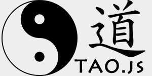

# Tao.js

**A simple, tiny (~3kB minified, ~1.5kB gzipped), isomorphic, precise and fast template engine for handling both string and live dom based templates.**




see also:

* [Contemplate](https://github.com/foo123/Contemplate) a light-weight template engine for Node/JS, PHP, Python, ActionScript
* [ModelView](https://github.com/foo123/modelview.js) a light-weight and flexible MVVM framework for JavaScript/HTML5
* [ModelView MVC jQueryUI Widgets](https://github.com/foo123/modelview-widgets) plug-n-play, state-full, full-MVC widgets for jQueryUI using modelview.js (e.g calendars, datepickers, colorpickers, tables/grids, etc..) (in progress)
* [Dromeo](https://github.com/foo123/Dromeo) a flexible, agnostic router for Node/JS, PHP, Python, ActionScript
* [PublishSubscribe](https://github.com/foo123/PublishSubscribe) a simple and flexible publish-subscribe pattern implementation for Node/JS, PHP, Python, ActionScript
* [Regex Analyzer/Composer](https://github.com/foo123/RegexAnalyzer) Regular Expression Analyzer and Composer for Node/JS, PHP, Python, ActionScript
* [Xpresion](https://github.com/foo123/Xpresion) a simple and flexible eXpression parser engine (with custom functions and variables support) for PHP, Python, Node/JS, ActionScript
* [Abacus](https://github.com/foo123/Abacus) a combinatorics computation library for Node/JS, PHP, Python, ActionScript
* [Dialect](https://github.com/foo123/Dialect) a simple cross-platform SQL construction for PHP, Python, Node/JS, ActionScript (in progress)
* [Simulacra](https://github.com/foo123/Simulacra) a simulation, algebraic, probability and combinatorics PHP package for scientific computations
* [Asynchronous](https://github.com/foo123/asynchronous.js) a simple manager for async, linearised, parallelised, interleaved and sequential tasks for JavaScript


Parts of this tiny project were implemented and used in other projects like Xpresion, Contemplate and ModelView. 
However decided to unify these parts into a tiny re-usable and modular library.


**API and Examples**

```html
<script src="./Tao.js"></script>
<!-- assume a dom template like this: -->
<div id="node" class="$(className)">Hello $(user), your location is $(location)</div>

```

```javascript
// Tao is a UMD module and can be used in both Node, browser <script></script> tags and requireJS
var isNode = 'undefined' !== typeof global && '[object global]' === Object.prototype.toString.call(global);
var Tao = isNode ? require('./Tao.js') : window.Tao;
var tpl = isNode ? '<div id="node" class="$(className)">Hello $(user), your location is $(location)</div>' : document.getElementById('node');
var keys_re = /\$\(([^\)]+)\)/;
var tpl_data = {className: 'div-class', user: 'Nikos', location: 'GR'};
var tao_renderer = Tao(tpl, keys_re);

// render/update templates

console.log(tao_renderer(tpl_data));

if ( isNode )
{
    // update the template with only partial data (previous values will be used where missing)
    console.log(tao_renderer({user: 'Yianis'}));
}

// dispose the templates and any dependencies
tao_renderer.dispose(); // does NOT remove any dom Node
```

**Tests**

see **./test.js** and **./test.html** for node and browser basic functionality tests


**Performance**

to be added


**Todo**

